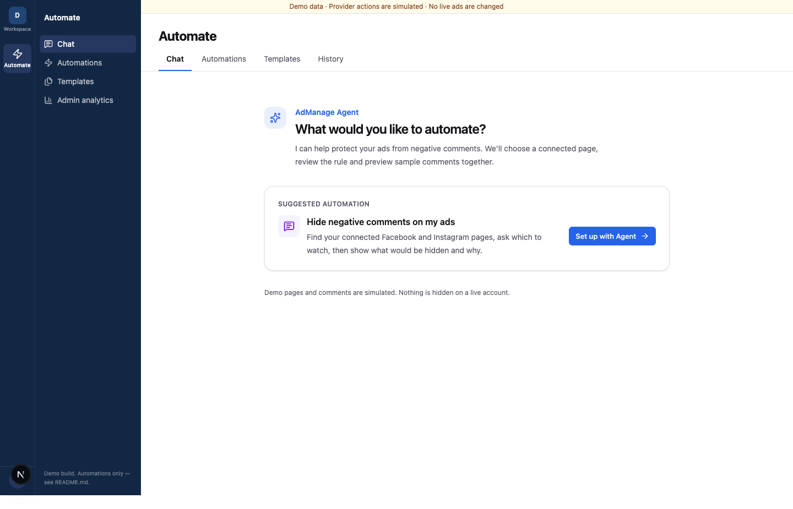
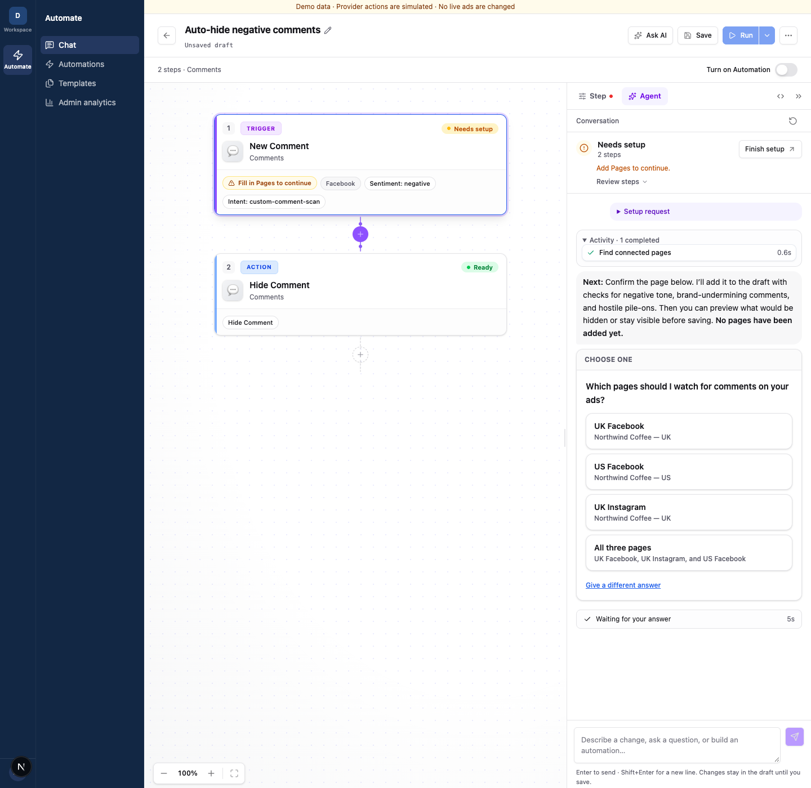
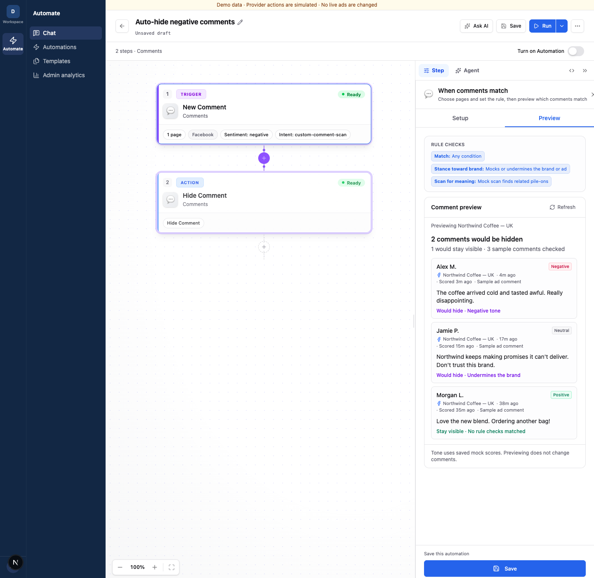
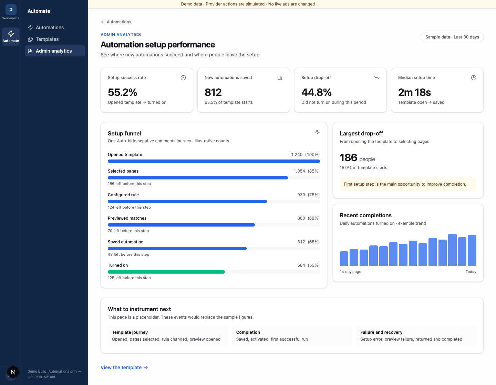

# Automation agent challenge

Improve the mock **Auto-hide negative comments** experience. This is the only flow. No real pages or comments are changed.

## Customer problem

Advertisers connect a Facebook Page to AdManage and want to hide negative comments on their ads to protect ad performance. They need to trust the Agent's page choice and see exactly which comments the rule would hide. This mock demo cannot prove performance lift.

## Your task

**Delete confusing UI and improve it.** The current design is a starting point.

1. **Agent setup:** Start at **Automate → Chat** and choose **Hide negative comments on my ads**. The Agent should find connected pages, ask which to watch, set up the rule, and preview both hidden and visible comments with reasons. Make draft, saved, and on states clear, with one next action.
2. **Health dashboard:** Replace **Admin analytics**. Show setup drop-off, Agent failures, successful runs, and the biggest problem to fix next. Count people or journeys; deduplicate retries.

**Main KPI — first successful automation rate:** Of people who start this template, what percentage save it, turn it on, and get a first successful simulated comment-hiding run within 7 days? Show the numerator, denominator, and time window. Use only starts old enough to have a full 7 days.

The demo includes mock pages, scored comments, and journey events. Adapt them for this flow; label results as simulated.

## Current screens

These are starting points you can replace.

**Chat start**



**Agent page choice**



**Comment preview**



**Admin analytics placeholder**



## Run

```bash
pnpm install --frozen-lockfile
pnpm dev
pnpm typecheck && pnpm test && pnpm build
```

Open `http://localhost:3000/automation` (or the port Next.js prints). No accounts, keys, or write-up needed. We will review the running UI and dashboard.
