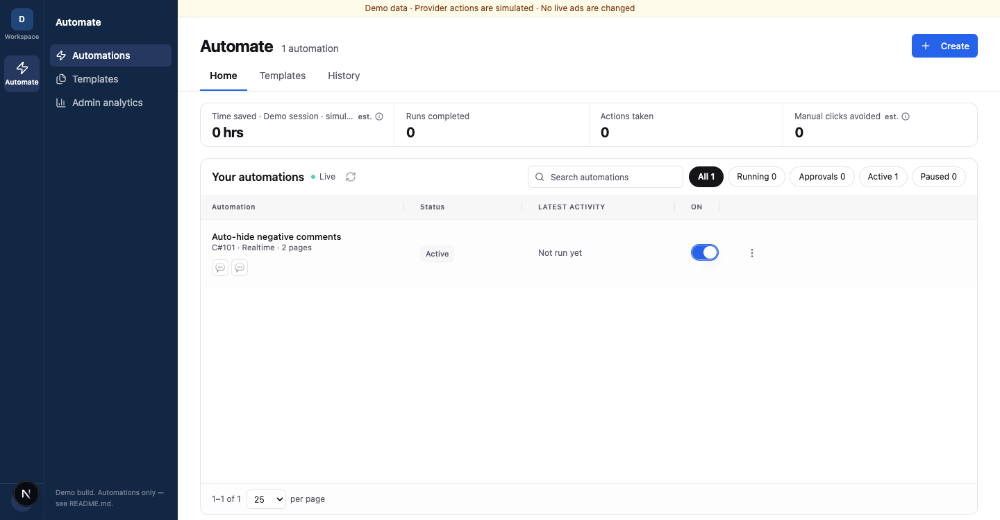

# Automation agent challenge

Improve the mock **Auto-hide negative comments** experience. This is the only flow. No real pages or comments are changed.

## Customer problem

Customers cannot tell which pages are watched, why comments are hidden, or whether the flow is on. Some ask the Agent to explain its own draft. Make the behavior and next step clear before activation.

## Your task

**Delete confusing UI and improve it.** The current layout and code are starting points.

1. **Agent setup:** Start at **Automate → Create**. Find mock pages and ask which to watch. Configure the rule and hide action. Preview mock comments that would be hidden or stay visible, with reasons. Make draft, saved, and on states clear, with one useful next action.
2. **Health dashboard:** Replace the **Admin analytics** placeholder. Show where setup drops off, Agent failures, successful runs, and the biggest problem to fix next. Count people or journeys, not raw events; retries must not inflate results.

**Main KPI — first successful automation rate:** Of people who start this template, what percentage save it, turn it on, and get a first successful simulated comment-hiding run within 7 days? Show the numerator, denominator, and time window. Use only starts old enough to have a full 7 days.

The demo includes mock pages, scored comments, and journey events with retries and failures. Adapt them for this flow; label results as simulated.

## Current screens

These are starting points you can replace.

**Automations home**



**Agent page choice**


**Comment preview**


**Admin analytics placeholder**


## Run

```bash
pnpm install --frozen-lockfile
pnpm dev
pnpm typecheck && pnpm test && pnpm build
```

Open `http://localhost:3000/automation` (or the port Next.js prints). No accounts, keys, or write-up needed. We will review the running UI and dashboard.
