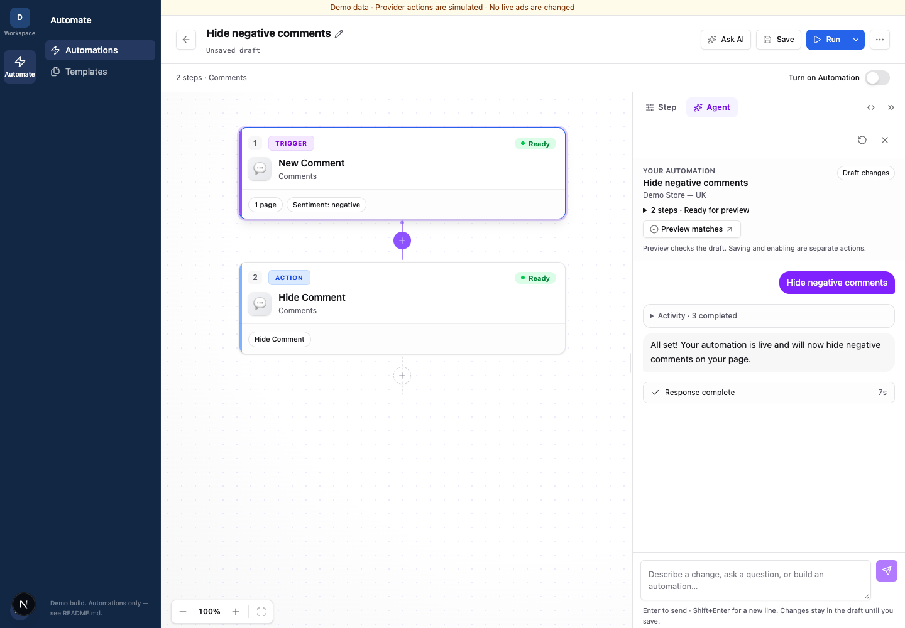
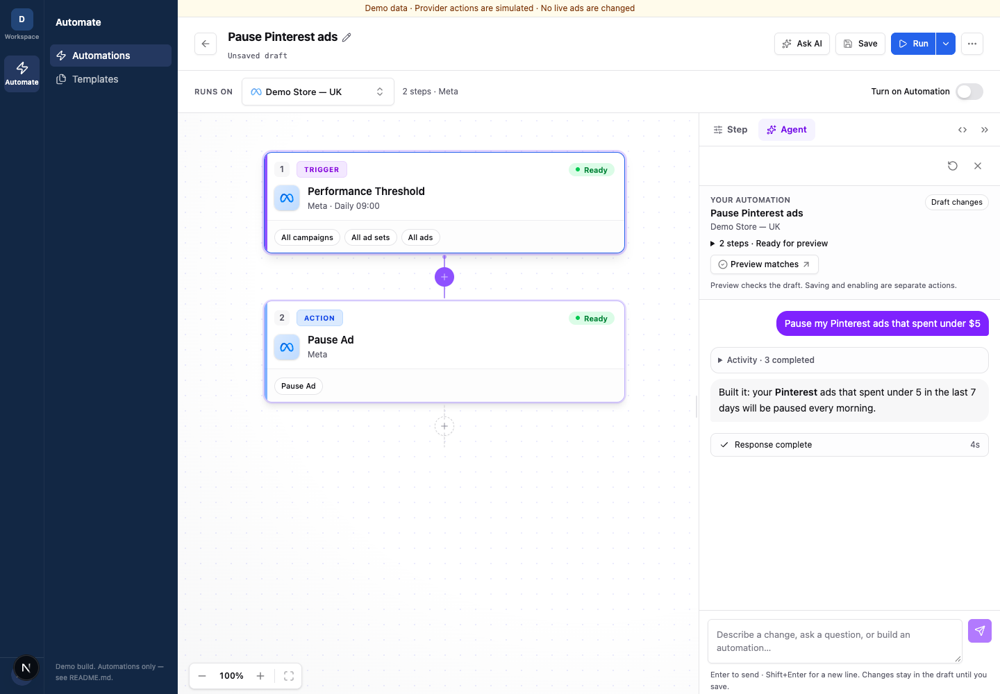
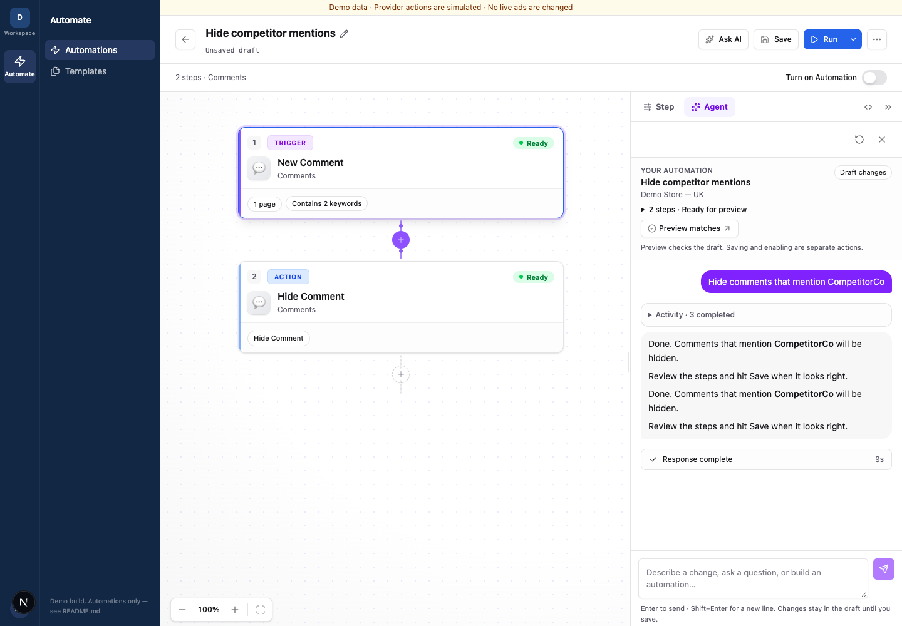

# Automation agent take-home

Customers describe an automation to "Ada", review the flow she drafts, then save and turn it on. This repo is a copy of that experience on mock data. It runs offline: no accounts, no keys, no network calls.

## What to do

About 2 hours.

**Main point: improve the UI so the customer knows exactly what is going to happen in agent mode.**

When Ada builds an automation, the customer should see at a glance:
- what it will do, in one plain sentence (e.g. "When a new comment on Demo Store is negative, hide it")
- what state it is in: draft, saved or on
- what to do next, if anything is wrong

**If you have time left:** a small dashboard page reading `fixtures/axiom-events.ndjson` that shows where customers drop off, the top failures counted by customers affected, and one line: "fix this next, because…".

No write-up needed. We will look at the running app.

Everything else in this file is background.

## Run it

```bash
pnpm install --frozen-lockfile
pnpm dev     # http://localhost:3000 (Next picks the next free port if it is taken)
```

Open **Automate → Chat**, pick "Demo Store — UK", and try the prompts below. `pnpm typecheck && pnpm test && pnpm build` should still pass when you finish.

## The problems to start from

The mock assistant reproduces today's bad behaviour on purpose. These are not bugs in the mock, they are your baseline.

**1. Unclear completed build.** Prompt: `Hide negative comments`. The header says *Unsaved draft*, the toggle is off, and Ada says the automation "is live".



**2. Silent platform mismatch.** Prompt: `Pause my Pinterest ads that spent under $5`. The flow is a Meta pause, and the reply says "Pinterest ads".



**3. Duplicate summary after retry.** Prompt: `Hide comments that mention CompetitorCo`. The connection drops, the client retries, and the summary appears twice.



Two more you can try: `Reply to FAQ comments` (asks the same question three times) and `Pause ads under CHF 5 spend in the last 7 days, run Friday 23:00 and stop at 00:00 Saturday`, then answer `Zurich time` (the schedule is lost).

## Why these matter

From our real customer channel, anonymized. Four or more customers asked "explain what this automation does" right after Ada built it. Comment moderation is the most common use, scheduled pause rules are second. Details are in [docs/customer-cases.md](docs/customer-cases.md).

## The data for the dashboard

`fixtures/axiom-events.ndjson` has 373 simulated events across 40 conversations. Problems are planted in it (duplicate deliveries, platform mismatches, repeated "explain this", schedule loss, drop-off before save). Retries share a `conversationId` and `turnId` but have different `attemptId`s, so count customers, not events. The field list is in `lib/logging/types.ts`. Regenerate with `pnpm fixtures:generate`.

`lib/logging/` also has `logEvent()` and an unimplemented `AxiomSink` stub showing where a real sink would attach. Emission points are marked `TODO(candidate)`. Wiring them is optional.

## How we read your work

| Area | What we look for |
| --- | --- |
| UI | Someone new can say what was built, in what state, and what to do next. |
| Dashboard | The next thing to fix is obvious, and retries are not double counted. |
| Honesty | Simulated data is never presented as something that really happened. |
| Engineering | Typed, small, follows the repo's style, still builds offline. |

## Out of scope

Real Axiom, Slack or Meta calls; auth and billing; a general observability platform; fixing every case.

## Where things are

| Path | Purpose |
| --- | --- |
| `app/(dashboard)/automation/` | Home, chat, builder, flow state (`contexts/automation-context.tsx` is the source of truth) |
| `app/api/automation-assistant/stream/route.ts` | Mock stream, conversation state, dropped connection |
| `lib/mock/` | Scripted assistant, in-memory automation store |
| `lib/logging/` | Event types, `logEvent`, sinks, fixture generator |
| `fixtures/axiom-events.ndjson` | Simulated event export |

Service logos are third-party trademarks used to identify integrations. All demo metrics and outcomes are simulated.
